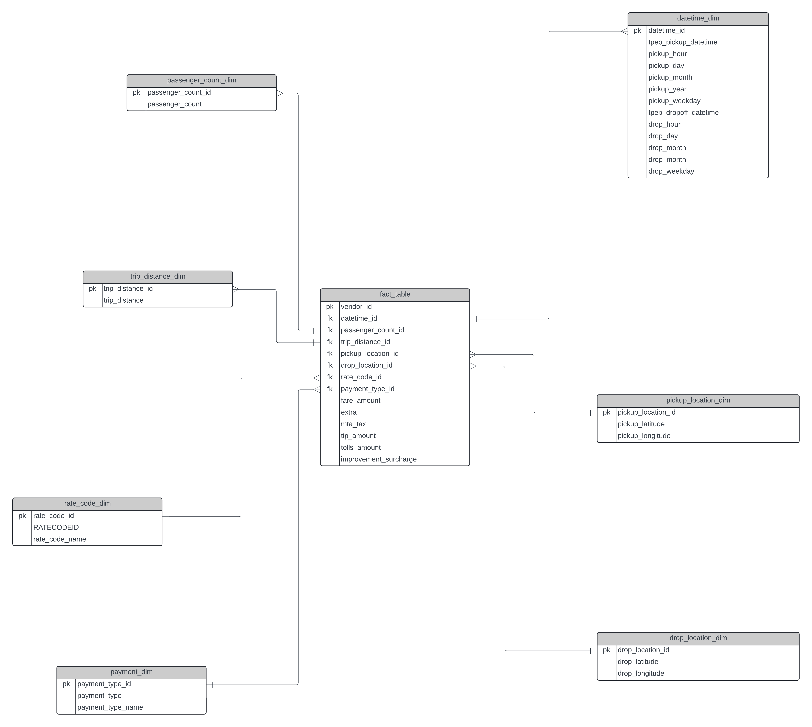
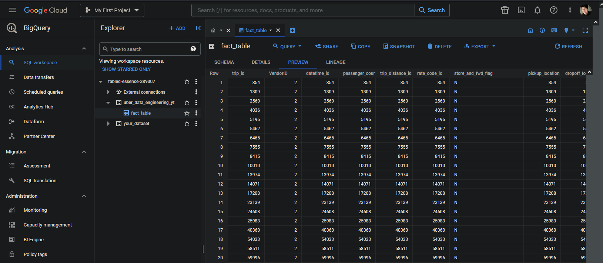
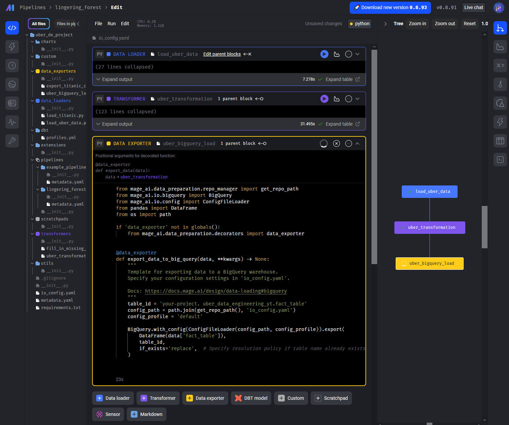
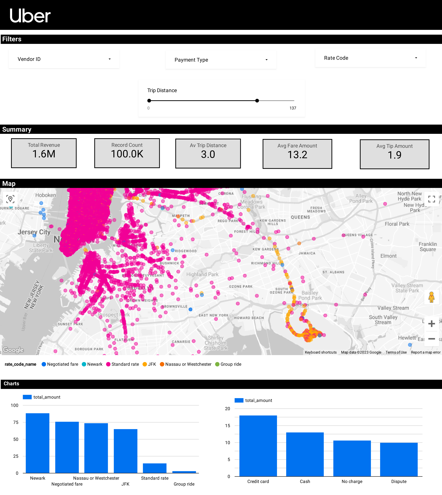

# Uber Data Analytics | Data Engineering GCP Project

This project uses GCP Storage, Python, Compute Instance, Mage Data Pipeline Tool, BigQuery, and Looker Studio for performing data analytics on Uber data and building a Dashboard.

## Architecture

## Technology Used
- **Programming Language:** Python

**Google Cloud Platform:**
1. Google Storage
2. Compute Instance
3. BigQuery
4. Looker Studio

**Modern Data Pipeline Tool:** [Mage](https://www.mage.ai/)

## Dataset Used
##### TLC Trip Record Data includes pick-up/drop-off dates and times, locations, trip distances, fares, rate types, payment types, and passenger counts.

For more information about the dataset:
1. [Website](https://www.nyc.gov/site/tlc/about/tlc-trip-record-data.page)
2. [Data Dictionary](https://www.nyc.gov/assets/tlc/downloads/pdf/data_dictionary_trip_records_yellow.pdf)

## Data Model

## Workflow: Mage -> GCP (BigQuery) -> Looker Studio

       
 
  

## Dashboard

